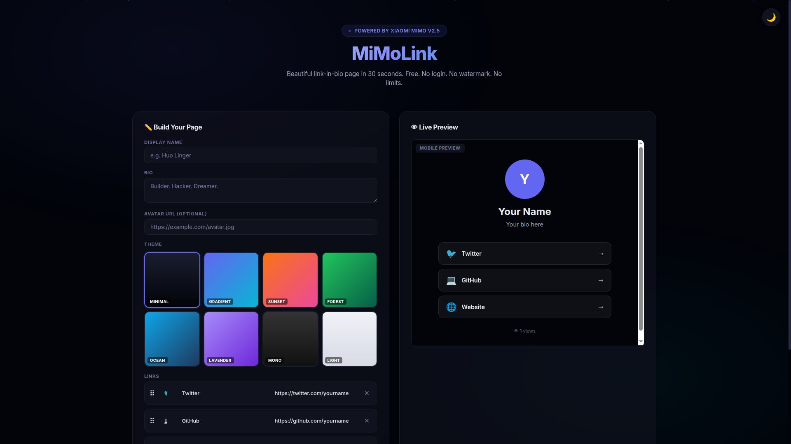
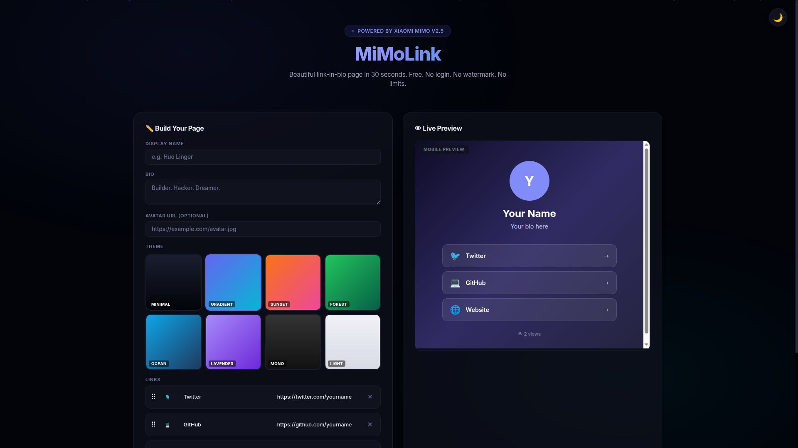
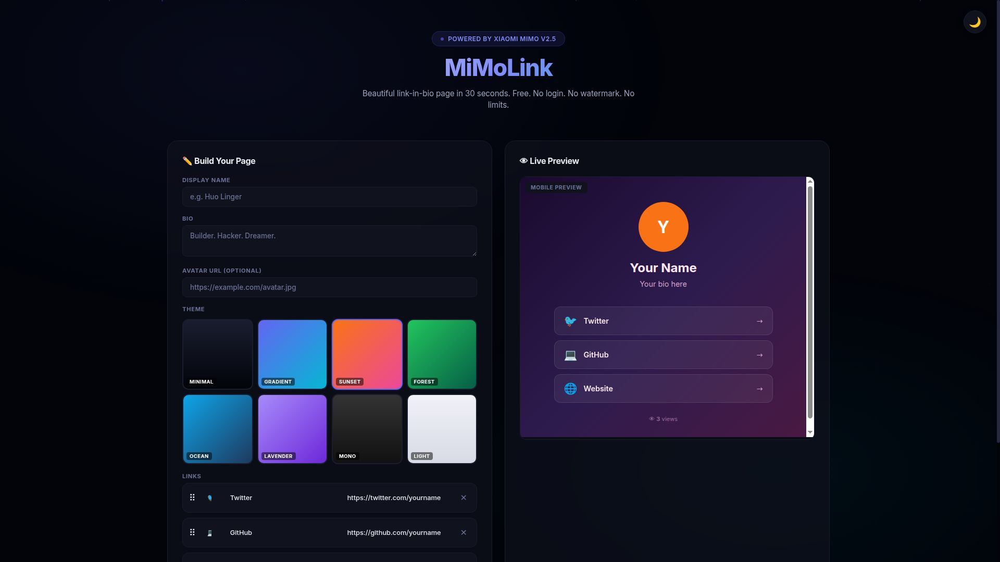
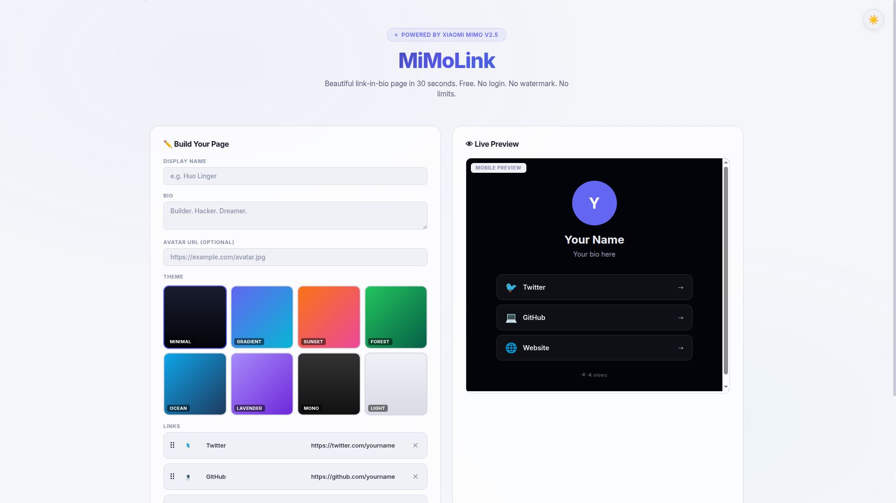
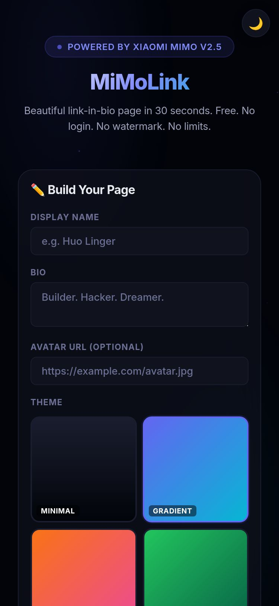

<div align="center">

# 🔗 MiMoLink

### Smart Link-in-Bio Builder — Free, No Login, No Limits

Beautiful link-in-bio page in 30 seconds. No watermark. No signup. No monthly fee. Just your links, your style.

[](https://gyoomei.github.io/mimolink/)
[](https://100t.xiaomimimo.com)
[](LICENSE)

[](https://github.com/gyoomei/mimolink/stargazers)
[](https://github.com/gyoomei/mimolink/issues)
[](https://github.com/gyoomei/mimolink/commits)
[](#)
[](#)

</div>

---

## 📖 The Problem

Linktree free tier: 5 links, watermark, no analytics, limited themes.
Other alternatives: login required, data harvesting, monthly fees.

**You just want a page with your links. Why is it so complicated?**

## 💡 The Solution

MiMoLink: enter your info, add links, pick a theme, download a single HTML file. Deploy anywhere — GitHub Pages, Netlify, your own server. **You own it.**

```
You enter:  Name + bio + links
You pick:   8 beautiful themes
You get:    Single HTML file → deploy anywhere
Cost:       $0. Forever.
```

**That's the entire UX — fill, pick, download.**

---

## ✨ Features

- **🎨 8 Beautiful Themes** — Minimal, Gradient, Sunset, Forest, Ocean, Lavender, Mono, Light
- **🔗 Unlimited Links** — No 5-link limit. Add as many as you want.
- **🚫 No Watermark** — Your page, your brand. No "Made with Linktree"
- **👁 View Counter** — Built-in page view tracking (localStorage)
- **📱 Responsive** — Looks perfect on mobile, tablet, desktop
- **🌙 Dark/Light Builder** — Comfortable editing in any lighting
- **⬇ One-Click Download** — Get your HTML file instantly
- **🚀 Deploy in 2 Minutes** — GitHub Pages, Netlify, or any static host
- **🔒 100% Private** — No account, no tracking, no data collection

---

## 🖥️ Screenshots

| | |
|---|---|
|  |  |
| **Builder — Dark Mode** | **Gradient Theme Preview** |
|  |  |
| **Sunset Theme** | **Light Mode Builder** |
|  |  |
| **Mobile View** | **Generated Link Page** |

---

## 🔧 How It Works

```
┌─────────────────────────────────────────┐
│  1. Enter name, bio, avatar URL         │
│  2. Add links (title + URL + icon)      │
│  3. Pick a theme (8 options)            │
│  4. Live preview updates instantly      │
│  5. Download single HTML file           │
│  6. Upload to GitHub Pages / any host   │
│                                         │
│  Result: yourname.github.io/links/      │
│  Beautiful. Free. Yours forever.        │
└─────────────────────────────────────────┘
```

---

## 📊 MiMoLink vs Alternatives

| Feature | Linktree Free | Linktree Pro | **MiMoLink** |
|---------|:---:|:---:|:---:|
| Price | $0 | $24/mo | **$0** |
| Links | 5 | Unlimited | **Unlimited** |
| Watermark | ✅ | ❌ | **❌** |
| Custom themes | ❌ | ✅ | **✅ 8 themes** |
| Analytics | Basic | Advanced | **View counter** |
| Own your data | ❌ | ❌ | **✅ 100%** |
| Login required | ✅ | ✅ | **❌** |

---

## 🚀 Quick Start

```bash
# Open builder
https://gyoomei.github.io/mimolink/

# Or clone + run locally
git clone https://github.com/gyoomei/mimolink.git
open index.html
```

### Deploy to GitHub Pages (2 min):

1. Download your HTML from the builder
2. Create new GitHub repo (e.g. `my-links`)
3. Upload as `index.html`
4. Settings → Pages → Deploy from branch
5. Live at `https://username.github.io/my-links/`

---

## 🎨 Available Themes

| Theme | Style | Best For |
|-------|-------|----------|
| Minimal | Dark, clean | Developers, minimalists |
| Gradient | Purple-blue | Creatives, designers |
| Sunset | Orange-pink | Artists, influencers |
| Forest | Green tones | Sustainability, nature |
| Ocean | Blue deep | Tech, professionals |
| Lavender | Purple dream | Musicians, streamers |
| Mono | Pure black/white | Ultra-minimal |
| Light | Clean white | Business, corporate |

---

## 🔒 Privacy

- **Zero data collection** — Everything runs in your browser
- **No accounts** — No sign-up, no login, no tracking
- **No backend** — Generated HTML is fully self-contained
- **Your data stays yours** — Nothing leaves your browser

---

<div align="center">

**Built for [Xiaomi MiMo 100T Creator Program](https://100t.xiaomimimo.com)**

Single zero-dependency HTML · Free forever · No login required

</div>
